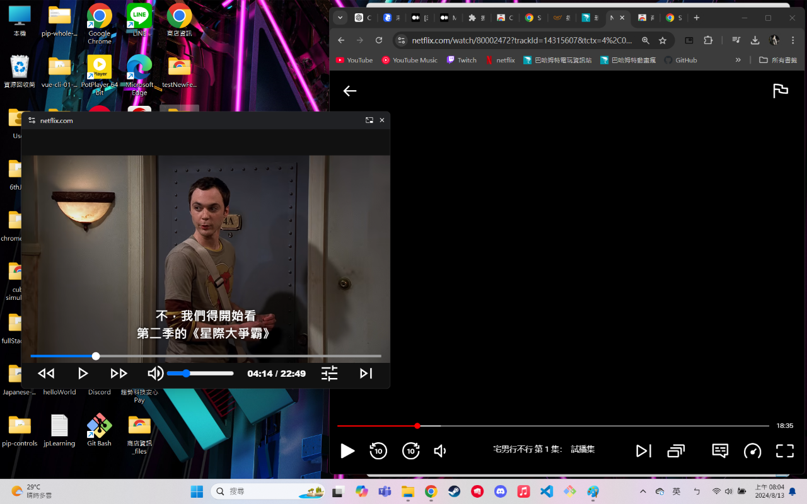
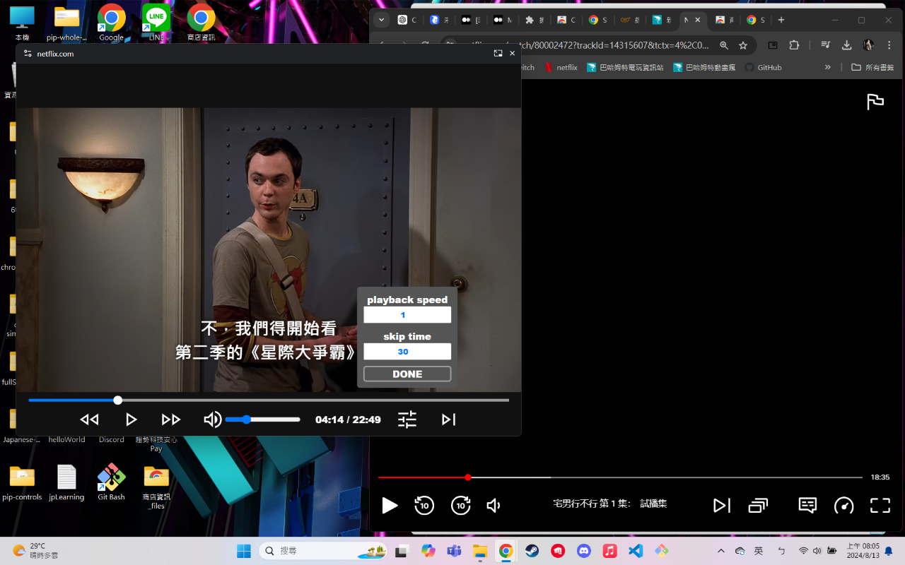

# floating-video-v2
making netflix,動畫瘋 video floating on the top  
This is a google extension using [Document Picture-in-Picture API](https://developer.mozilla.org/en-US/docs/Web/API/Document_Picture-in-Picture_API)  to make the video floating.  
If you want to try it, welcome to [Google Extension Page](https://chromewebstore.google.com/detail/netflix%E5%8B%95%E7%95%AB%E7%98%8B-always-on-topp/obkpdamfpofofcakajilgpgehdlbmjmn?authuser=0&hl=zh-TW). 

## How to use
Download the extension and click the extension icon, it will shown like below  
 

You can customize your forward/rewind skiptime and playback speed like below  
 
Press **[DONE]** button if all set.  

When the floating window is focused, there are some hotkeys you can use 
<ul>
  <li>'space' : play/pause</li>
  <li>'enter' : play/pause</li>
  <li>'right/left' : forward/rewind</li>
  <li>'up/down' : increase/decrease volume</li>
  <li>'m' : mute/unmute</li>
</ul>

## Why this extension failed?
<ol>
  <li>
    this extension is only work for <a href="https://www.netflix.com/browse">netflix</a> or <a href="https://ani.gamer.com.tw/">動畫瘋</a>.
  </li>
  <li>
    due to security policy,those 2 websites may not let this extension's code running.
    e.g. TrustedHTML
  </li>
</ol>

### Contact me
<ul>
  <li><a href="https://www.instagram.com/swaggershih/?next=%2F">Instagram</a></li>
  <li><a href="mailto:feelstyle1103@gmail.com">Email</a></li>
</ul>

